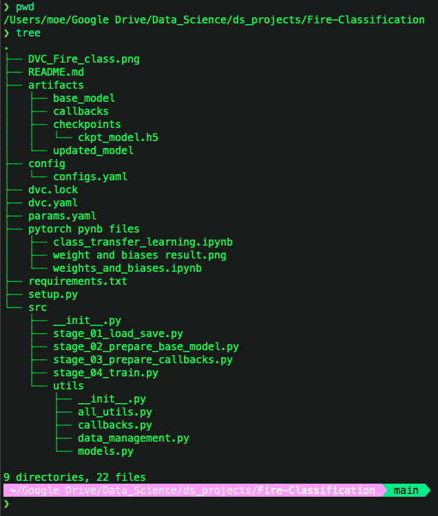
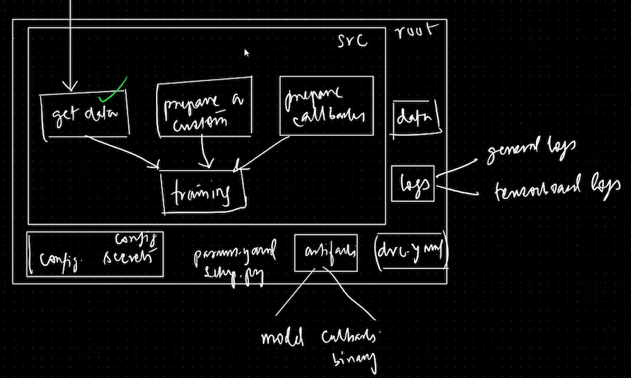
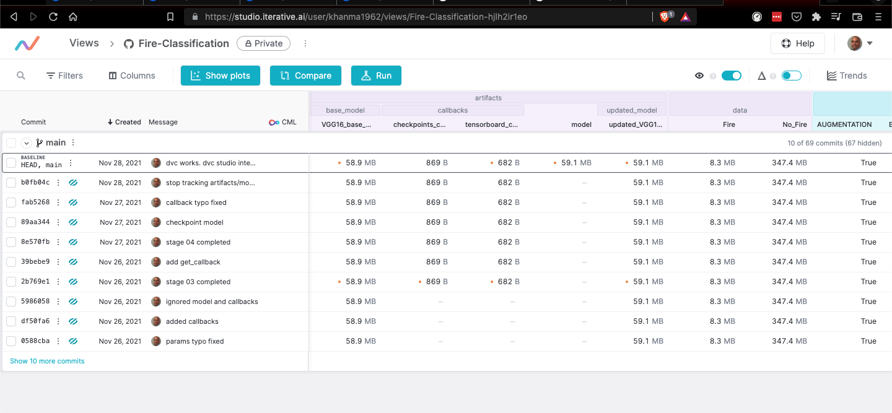
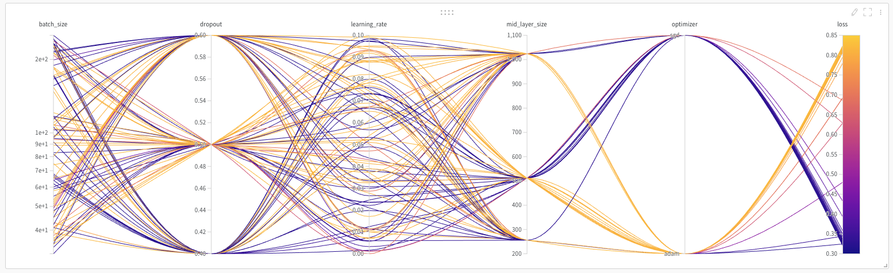

# Fire Classifcation - End to End Pipeline Machine Learning Pipeline with MLOps Tools 

In this project, I downloaded 500 images each with Fire/No_Fire from internet, created stages like load data, prepare model, prepare callback, train, etc., and trained pre-trained VGG16 model using tensorflow. Wrote all relevant utilities code. Finally, used DVC(Data Version Control) and DVC Studio to implement version control of data, code, and model.

